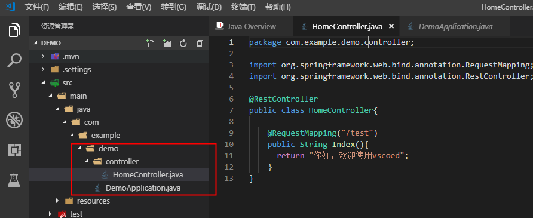
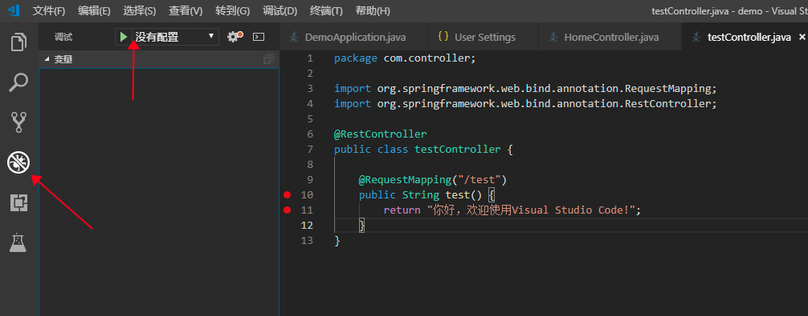
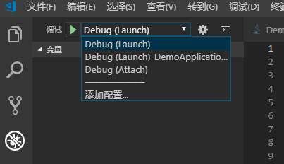
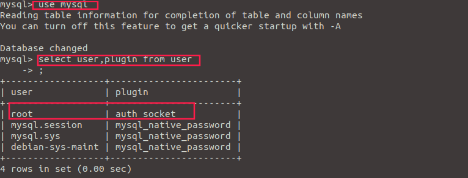
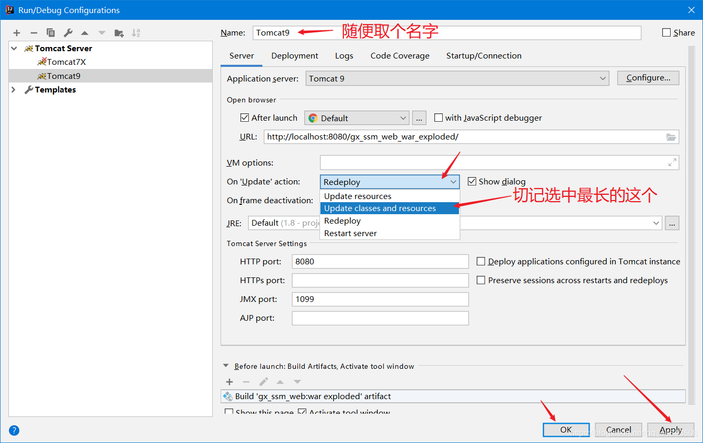
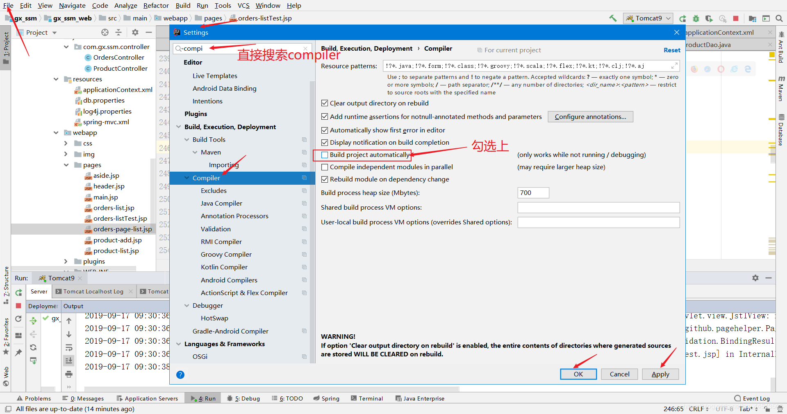
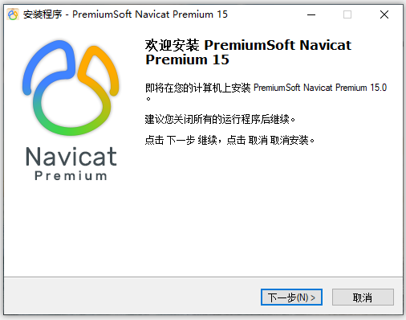
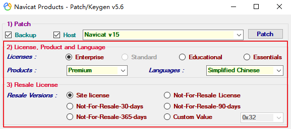
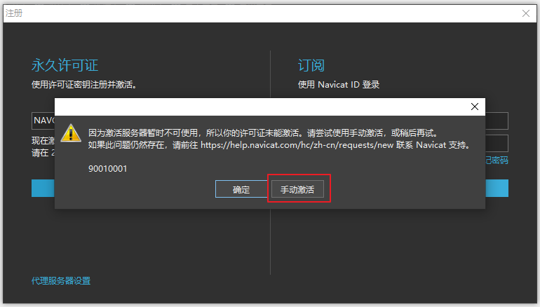
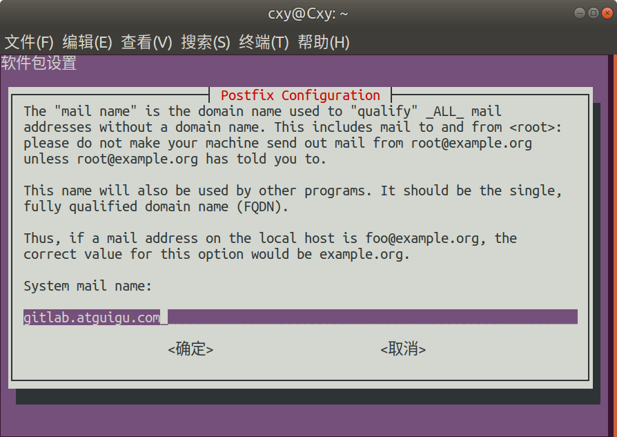

[TOC]

# 1. linux mplayer 

- 安装

  用Ctrl+Alt+T或者直接鼠标右键打开一个终端

  输入指令下载安装mplayer

  ```
  $ sudo apt-get install mplayer
  ```

  安装完成后，输入指令,查看是否安装成功。

  ```
  $ mplayer
  ```

  好了，现在，我们就可以找到要播放的视频，查看一下视频所在路径


- 使用

  1.  播放

     ```
     $ mplayer 视频路径
     ```

  2.  快捷键

     ```
     [: 以0.1的步长减速
     ]: 以0.1的步长加速
     shift + [ : 以0.5的步长减速
     shift + ] : 以0.5的步长加速
     ```


# 2. anaconda + opencv + tensorflow

1. 安装anaconda

   在官网下载安装包，然后cd到安装包路径

   ```
   $ bash Anaconda3-5.3.1-Linux-x86_64.sh
   ```

   安装时可同意安装python和vscode

   **测试：** $ anaconda-navigator

2. 安装tensorflow

   anaconda-navigator中新建一个环境，在环境中安装tensorflow

3. 安装opencv

   一定要先安装opencv的依赖库：

   ```
   sudo apt-get install build-essential
   sudo apt-get install cmake git libgtk2.0-dev pkg-config libavcodec-dev libavformat-dev libswscale-dev
   sudo apt-get install python-dev python-numpy libtbb2 libtbb-dev libjpeg-dev libpng-dev libtiff-dev libjasper-dev libdc1394-22-dev
   ```

   在环境中安装opencv

4. vscode配置

   先新建工作环境，再配置debug，选择当前环境下的python为编译器

5. opencv报错解决

   1. 路径问题

   ```
   cv2.error: OpenCV(3.4.3) /io/opencv/modules/highgui/src/window.cpp:356: error: (-215:Assertion failed) size.width>0 && size.height>0 in function 'imshow'
   ```

   解决：注意路径为/home/cxy/... 

   2. 权限问题

      ```
      Cannot connect to X server :0.0
      ```

      - DISPLAY not set in the environment.
         **Solution**: 

        ```
        $ export DISPLAY=:0.0
        ```

      - Non-Authorised User trying to run the X Application
         **Solution** ( as X owning user, ie: yourself )

        ```
        $ xhost +$HOSTNAME
        ```

# 3. linux Java + IntelliJ

- Java

  1. 下载 Java <a href="https://www.oracle.com/technetwork/java/javase/downloads/jdk8-downloads-2133151.html">安装包</a>

  2. 解压并移动至/usr/local

     ```
     $ sudo mv jdk-8u231-linux-x64 /usr/local
     ```

  3. 配置环境

     使用如下命令打开~/.bashrc文件

     ```
     $ gedit ~/.bashrc
     ```

     在文件末尾加上Java信息

     ```
     export JAVA_HOME=/usr/local/jdk-8u231-linux-x64/jdk1.8.0_231
     export JRE_HOME=${JAVA_HOME}/jre
     export CLASSPATH=.:${JAVA_HOME}/lib:${JRE_HOME}/lib
     export PATH=${JAVA_HOME}/bin:$PATH
     ```

  4. 使用source命令使配置立即生效

     ```
     $ source ~/.bashrc
     ```

  5. 测试

     ```
     $ java -version
     ```

- IntelliJ

  1. 在官网下载<a href="https://www.jetbrains.com/idea/download/#section=linux">linux安装包</a>

  2. 解压到安装目录

  3. 安装包的bin目录下打开终端，执行：
  
     ```
      sh ./idea.sh
     ```
  
  4. <a href="https://zhile.io/2018/08/17/jetbrains-license-server-crack.html">激活</a>
  
     <a href="https://www.jetbrains.com/shop/eform/students">学生免费激活使用 </a>
  
  5. 设置部分自己视情况而定

# 4. 用git上传文件到Github

1. 在github中新建一个repositories，并命名

2. 安装git，ubantu上自带，若没有则：

   ```
   $ sudo apt-get install git
   ```

3. 生成密钥

   ```
   $ ssh-keygen -t rsa -C "946704740@qq.com"
   ```

   之后会要求确认路径和输入密码，默认一路回车就行。

4. 成功的话会在～/下生成.ssh文件夹，按住ctrl+h可以显示隐藏文件夹，点进去，打开id_rsa.pub，复制里面的key。

5. 回到github，进入Account Setting，左边选择SSH Keys，Add SSH，title随便填，粘贴key.

6. 在将本地仓库上传到github之前，需要设置username和email，因为github每次commit都会记录他们。

   ```
   $ git config --global user.name "onlyou2030"
   $ git config --global user.email 529647632@qq.com
   ```

7. cd到要上传的仓库路径，添加远程地址

   ```
   git remote add origin git@github.com:yourName/yourRepo.git
   ```

8. 添加，提交，上传

   ```
   $ git add README
   $ git add . //添加所有文件
   $ git commit -m "first commit"
   $ git push origin master
   ```

   git push命令将本地仓库推送到远程服务器，git pull相反。

9. 合并

   在上面提交命令后，可能会出现“因为您当前分支的最新提交落后于其对应的远程分支”等类似错误，需要先获取远端更新并与本地合并，再git push

   ```
   $ git fetch origin   //获取远程更新
   $ git merge origin/master
   $ git push origin master
   ```

# 5. Linux <a href="http://archive.cloudera.com/cdh5/cdh/5/hadoop-2.6.0-cdh5.9.3/hadoop-project-dist/hadoop-common/SingleCluster.html">Hadoop安装</a>

**Required Software** 

Required software for Linux include:

1. Java™ must be installed. Recommended Java versions are described at [ HadoopJavaVersions](http://wiki.apache.org/hadoop/HadoopJavaVersions).
2. ssh must be installed and sshd must be running to use the Hadoop scripts that manage remote Hadoop daemons.

**安装**

### 5.2  ssh免密登陆 

If your cluster doesn't have the requisite software you will need to install it.

For example on Ubuntu Linux:

```
  $ sudo apt-get install ssh
  $ sudo apt-get install rsync
```

`$ ssh localhost或者 $ ssh 主机名` （`$ exit退出`）都会要求输入密码，使得有些交互无法进行，故需要设置免密登陆。

免密配置：

zhu: 如果已经生成过ssh-key则不用生成了否则将把原来的覆盖，使有些操作失效。如git不能推送到远程仓库

```shell
$ ssh-keygen -t rsa
```

一路回车或yes

```shell
$ ls -a //-a查看隐藏文件夹，.开头的是隐藏文件夹
$ cd .ssh
$ ls
id_rsa  id_rsa.pub  known_hosts
$ ll
-rw-------  1 cxy cxy 1679 11月 29 19:16 id_rsa  私钥
-rw-r--r--  1 cxy cxy  389 11月 29 19:16 id_rsa.pub 公钥
-rw-r--r--  1 cxy cxy 2354 11月 29 19:15 known_hosts

$ cat id_rsa.pub >> authorized_keys //复制id_rsa.pub 到 authorized_keys
$ chmod 600 authorized_keys //设置权限

/**测试**/
$ ssh Cxy  //不用输密码了
```

### 5.3 Hadoop安装

- 下载：http://archive.cloudera.com/cdh5/cdh/5/

             hadoop-2.6.0-cdh5.9.3.tar.gz   hive-1.1.0-cdh5.9.3.tar.gz

- 解压到 ： ~/app

- **配置：**

  1)  **etc/hadoop-env.sh**

  ```
    # set to the root of your Java installation
    export JAVA_HOME=/usr/java/latest
  
    # Assuming your installation directory is /usr/local/hadoop
    export HADOOP_PREFIX=/usr/local/hadoop
  ```

  修改Hadoop配置文件, 添加HADOOP_HOME/bin到系统环境变量

  ```shell
  $ vi ~/app/hadoop-2.6.0-cdh5.9.3/etc/hadoop/hadoop-env.sh
  $ echo $JAVA_HOME //查看$JAVA_HOME（Linux系统自带Java）
  ```

  为了防止自动获取JAVA_HOME失败，手动添加。将原来的`export JAVA_HOME=${JAVA_HOME}`语句注释掉，改为(后面的地址写自己的JAVA_HOME地址)：

  ```shell
  export JAVA_HOME=/home/cxy/Hdp/app/jdk1.8.0_231
  ```

  2)  **etc/hadoop/core-site.xml**

  将下面<configuration></configuration>里的内容存到配置文件的<configuration></configuration>里

  ```
  <configuration>
      <property>
          <name>fs.defaultFS</name>
          <value>hdfs://localhost:8020</value>
      </property>
  </configuration>
  ```

  3) **etc/hadoop/hdfs-site.xml**

  ```
  <configuration>
      <property>
          <name>dfs.replication</name>
          <value>1</value>
      </property>
      
      <property>
          <name>hadoop.tmp.dir</name>
          <value>/home/cxy/Hdp/app/tmp</value>
      </property>
      
  </configuration>
  ```

  注：第二个属性中/home/cxy/Hdp/app/tmp路径用来存放临时文件，因为hadoop.tmp.dir的默认路径...tmp重启会被清空

  4)  **etc/hadoop/slaves**

  ```shell
  $ vi slaves
  ```

  将localhost改为你的主机名

  5) 到根目录下将Hadoop配置到环境变量

  ```shell
  $ vi ~/.bash_profile
  ```

  输入：

  ```
  export HADOOP_HOME=/home/cxy/Hdp/app/hadoop-2.6.0-cdh5.9.3
  export PATH=$HADOOP_HOME/bin:$PATH
  ```

  `:x`或`:wq`保存退出

  ```shell
   $ source ~/.bash_profile
  ```

  以上配置完成后，第一次启动Hadoop必须要格式化，格式化不要重复执行

  ```shell
  $ cd $HADOOP_HOME/bin
  $ hdfs namenode -format //格式化
  ```

  如果格式化没报错则配置完成

### 5.4 启动集群

执行$HADOOP_HOME/sbin/start-dfs.sh

```shell
$ ./start-dfs.sh
```

提示输入yes

```shell
$ jps
21364 DataNode
28201 Jps
21023 NameNode
```

DataNode，NameNode创建成功，启动成功

# 6. VS Code + Java开发

## 6.1 Maven

环境搭建：

extension：

Maven for Java;

创建project：

Ctrl + shift + p 或者左侧浏览器MAVEN PROJECT 处点 +  --> 选择 maven-archetype-quicksstart  --> 选择目录地址 --> 选择版本1.0 --> 选择包名

# 7. 如何使用VS Code编写Spring

#### 1. 安装扩展(Ctrl+Shift+X)

- [Java Extension Pack (Java 扩展包)](https://marketplace.visualstudio.com/items?itemName=vscjava.vscode-java-pack)
- Spring Boot Extension Pack


#### 2. 配置Maven：

点左下角的设置图标->设置，打开设置内容筛选框，输入maven，然后点击右侧的打开json格式setting：


然后把:

- maven的可执行文件路径配置
- maven的setting路径配置
- java.home的路径配置

拷贝到右侧的用户设置区域并且设置为自己电脑的实际路径


也可以直接在设置界面中设置，记住两边都要配置好

#### 3. 创建Maven项目

使用快捷键(Ctrl+Shift+P)命令窗口，输入 Spring 选择创建 Maven 项目。 效果如下：


选择需要使用的语言、Group Id、项目名称等，这里选择Java：


选择Spring Boot版本：


选择需要引入的包，引入如下几个包即可满足web开发：

DevTools（代码修改热更新，无需重启）、Web（集成tomcat、SpringMVC）、Lombok（智能生成setter、getter、toString等接口，无需手动生成，代码更简介）、Thymeleaf （模板引擎）。


选择好要引入的包后直接回车，在新弹出的窗口中选择项目路径，至此Spring Boot项目创建完成

#### 4. 打开项目

创建好后vscode右下角会有如下提示，点击Open it 即可打开刚才创建的Spring Boot项目


####  5. 项目运行跟调试

项目创建后会自动创建DemoApplication.java文件，在DemoApplication 文件目录下新建文件夹 Controller，新建文件HomeController.java。效果如下：



Ps:SpringBoot项目的Bean装配默认规则是根据DemoApplication类所在的包位置从上往下扫描。所以必须放在同一目录下否则会无法访问报如下所示错误：

启动工程之前还需要配置下运行环境，如下图，点左边的小虫子图标，然后点上面的下拉箭头，选择添加配置，第一次设置时VS Code会提示选择需要运行的语言环境，选择对应环境后自动创建 launch.json 文件。



launch.json 调试配置文件如下，默认不修改配置也可使用：


选择对应的配置环境调式项目如下，默认端口为8080。



启动后可在控制台输出面板查看启动信息，显示如下后，访问：http://localhost:8080即可


最终效果如下：


#### 6. 访问HTML页面

在spring boot 中访问html需要引入Thymeleaf （模板引擎）包，在创建项目时已引用该包这里不需在重复引用。在resources-->templates目录下创建Index.html文件，效果如下：


html内容：

```
<!DOCTYPE html>
<html lang="en" xmlns:th="http://www.w3.org/1999/xhtml">
<head>
    <meta charset="UTF-8"/>
    <title>第一个HTML页面</title>
</head>
<body>
<h1>Hello Spring Boot!!!</h1>
<p th:text="${hello}"></p>
</body>
</html>
```

 在controller目录下新建TestController.java文件，代码如下：

```
@Controller
public class TestController {

    /**
     * 本地访问内容地址 ：http://localhost:8080/hello
     * @param map
     * @return
     */
    @RequestMapping("/hello")
    public String helloHtml(HashMap<String, Object> map) {
        map.put("hello", "欢迎进入HTML页面");
        return "/index";
    }
}
```

Ps:如果要访问html页面注解必须为Controller不能为RestController。否则无法访问。

**RestController和Controller的区别：**

@RestController is a stereotype annotation that combines @ResponseBody and @Controller.
意思是：
@RestController注解相当于@ResponseBody ＋ @Controller合在一起的作用。
1)如果只是使用@RestController注解Controller，则Controller中的方法无法返回jsp页面，配置的视图解析器InternalResourceViewResolver不起作用，返回的内容就是Return 里的内容。

例如：本来应该到success.html页面的，则其显示success.

2)如果需要返回到指定页面，则需要用 @Controller配合视图解析器InternalResourceViewResolver才行。

3)如果需要返回json或者xml或者自定义mediaType内容到页面，则需要在对应的方法上加上@ResponseBody注解

效果展示如下：


到处基础配置结束，可以愉快的玩耍Spring Boot!


# 8. Tomcat安装

## Windows 环境

[下载地址](#<http://tomcat.apache.org/>)

1. 解压到安装目录

2. 配置环境变量

   | 变量名        | 变量值                                       |
   | ------------- | -------------------------------------------- |
   | CATALINA_BASE | D:\Program files\Apache\apache-tomcat-8.5.51 |
   | CATALINA_HOME | D:\Program files\Apache\apache-tomcat-8.5.51 |
   | Path          | %CATALINA_HOME%\bin                          |

3. 启动

   命令行中输入`startup` 或 `catalina run`，然后在浏览器地址栏输入如下验证：

   ```html
   localhost:8080
   //或
   127.0.0.1:8080
   ```

### Linux 环境

```shell
#将压缩包移动到新建文件夹，解压，删除压缩包
sudo mkdir /usr/local/Tomcat
sudo cp apache-tomcat-9.0.33.tar.gz /usr/local
sudo tar -zxvf apache-tomcat-9.0.33.tar.gz
sudo rm apache-tomcat-9.0.33.tar.gz

#设置权限，进入解压路径下的bin目录
sudo chmod 755 -R apache-tomcat-9.0.33
cd apache-tomcat-9.0.33/bin

#启动Tomcat
sudo ./startup.sh

#验证，通过在浏览器中输入下面地址，如果进入Tomcat首页即安装成功
localhost:8080
```


# 9. Mysql 安装

## 9.1 Windows 环境

1. 在官网下载 [MySQL](https://dev.mysql.com/downloads/mysql/) ， [安装版MySQL](https://link.zhihu.com/?target=https%3A//link.jianshu.com/%3Ft%3Dhttp%3A//dev.mysql.com/downloads/installer/)

2. 配置初始化的my.ini文件的文件

   解压后的目录并没有的my.ini文件，没关系可以自行创建在安装根目录下添加的my.ini（新建文本文件，将文件类型改为的.ini），写入基本配置： 记得改路径，Data文件夹会自动生成，无需创建

   ```ini
   [client]
   # 设置mysql客户端默认字符集
   default-character-set=utf8
    
   [mysqld]
   # 设置3306端口
   port = 3306
   # 设置mysql的安装目录
   basedir=D:\\Program files\\Oracle\\mysql-8.0.19-winx64
   # 设置 mysql数据库的数据的存放目录，MySQL 8+ 不需要以下配置，系统自己生成即可，否则有可能报错
   # datadir=D:\\Program files\\Oracle\\mysql-8.0.19-winx64\\Data
   # 允许最大连接数
   max_connections=20
   # 服务端使用的字符集默认为8比特编码的latin1字符集
   character-set-server=utf8
   # 创建新表时将使用的默认存储引擎
   default-storage-engine=INNODB
   ```

   配置文件中的路径要和实际存放的路径一致

3. 初始化MySQL

   > 运行`mysqld --initialize-insecure`自动生成无密码的root用户。
   > 运行`mysqld --initialize`自动生成带随机密码的root用户
   >
   > 
   >
   > 以==管理员的方式打开cmd==， 切换到安装目录下的bin目录下，执行：
   >
   > ```shell
   > mysqld --initialize --console
   > ```
   >
   > 输出：
   >
   > ```shell
   > ...
   > 2020-03-11T02:38:19.492703Z 5 [Note] [MY-010454] [Server] A temporary password is generated for root@localhost: OWMyd1?KzWj4
   > ```
   >
   > 记录下密码：OWMyd1?KzWj4
   >
   > 一定要以管理员的方式打开，不然会报错：Install/Remove of the Service Denied

4. 安装MySQL服务 + 启动MySQL 服务

   >安装：
   >
   >```shell
   >mysqld --install [服务名]（服务名可以不加默认为mysql）
   >```
   >
   >启动：
   >
   >```shell
   >net start mysql
   >```

5. 连接 MySQL

   > 下载 [Navicat](https://www.navicat.com.cn/download/navicat-premium)
   >
   > [安装与破解](#11. Navicat 安装与激活)
   >
   > MySQL的服务已经开启了就直接打开的Navicat去连接
   >
   > 
   >
   > **还记得刚刚让你复制的root @ localhost：后面的初始密码了吗？现在要用到它了复制粘贴上去！**
   >
   > 

6. 修改密码

   在 Navicat 中双击连接名，修改密码

## 9.2 Linux 环境

<a href = "https://dev.mysql.com/downloads/mysql/">MySQL下载</a>

### mysql 安装

```mysql
# 安装MySQL的依赖库
sudo apt install yum
sudo apt install numactl
sudo apt install libaio-dev

#解压mysql压缩包到 /usr/local/mysql 下
tar -zxvf mysql-8.0.19-linux-glibc2.12-x86_64.tar.xz  /usr/local/mysql
#也可解压后重命名为mysql，再移动到/usr/local/
sudo mv mysql /usr/local

#给Ubuntu系统添加一个mysql的用户组
groupadd mysql

#添加一个mysql用户到mysql用户组中
useradd -r -g mysql -s /bin/false/mysql

#切换到/usr/local/mysql目录
cd /usr/local/mysql

#然后给移动后的文件夹添加目录权限到mysql用户组
sudo mkdir mysql-files
sudo chown mysql:mysql mysql-files
sudo chmod 750 mysql-files

#对mysql数据库执行初始化命令
bin/mysqld --initialize --user=mysql

#开启MySQL服务
bin/mysqld_safe --user=mysql&
```

测试是否安装成功

```shell
mysqladmin --version
```

 linux上该命令将输出以下结果，该结果基于你的系统信息：

```shell
mysqladmin  Ver 8.42 Distrib 5.7.29, for Linux on x86_64
```

 如果以上命令执行后未输出任何信息，说明你的Mysql未安装成功。 


### 使用 MySQL Client(Mysql客户端) 执行简单的SQL命令

 你可以在 MySQL Client(Mysql客户端) 使用 mysql 命令连接到 MySQL 服务器上，默认情况下 MySQL 服务器的登录密码为空，所以本实例不需要输入密码。

命令如下：

```
[root@host]# mysql
```

 以上命令执行后会输出 mysql>提示符，这说明你已经成功连接到Mysql服务器上，你可以在 mysql> 提示符执行SQL命令：

```mysql
mysql> SHOW DATABASES;
```

### Mysql安装后需要做的

 Mysql安装成功后，默认的root用户密码为空，你可以使用以下命令来创建root用户的密码：

```mysql
[root@host]# mysqladmin -u root password "new_password";
```

 现在你可以通过以下命令来连接到Mysql服务器：

```mysql
[root@host]# mysql -u root -p
Enter password:*******

use mysql;
update user set host = '%' where user = 'root'; 
select host, user from user; 
flush privileges;#授权之后必须刷新权限才生生效
```

 **注意：**在输入密码时，密码是不会显示了，你正确输入即可。

### MySQL提示ERROR 1698 (28000): Access denied for user 'root'@'localhost'错误解决办法

#### Step1：修改mysqld.cnf配置文件

在ubuntu的terminal（也即终端）上输入

```shell
sudo vim /etc/mysql/mysql.conf.d/mysqld.cnf
```

进入到配置文件后在这个配置文件中的 **[mysqld]** 这一块中加入skip-grant-tables这句话。

[](javascript:void(0);)

```
 1 [mysqld]
 2 #
 3 # * Basic Settings
 4 #
 5 user            　 = mysql
 6 pid-file        　 = /var/run/mysqld/mysqld.pid
 7 socket        　　 = /var/run/mysqld/mysqld.sock
 8 port            　 = 3306
 9 basedir        　　= /usr
10 datadir       　　 = /var/lib/mysql
11 tmpdir       　　　= /tmp
12 lc-messages-dir   = /usr/share/mysql
13 skip-external-locking
14 character-set-server=utf8
15 collation-server=utf8_general_ci
16 skip-grant-tables　　　　<-- add here
```

**保存:wq，退出**。

```mysql
service mysql restart #重新启动mysql
```

#### step2：设置root密码

在终端上输入mysql -u root -p，遇见输入密码的提示直接回车即可,进入mysql后，分别执行下面三句话：

```mysql
use mysql;
update user set authentication_string=password("12345c") where user="root"; 
flush privileges;

select user, plugin from user;

#如果plugin root的字段是auth_socket，那我们改掉它
#改为下面的 mysql_native_password，如果和该字段内其它值一样，就直接quit
update user set authentication_string = password("12345c"),plugin = 'mysql_native_password' where user='root';

flush privileges;
select user,plugin from user;

quit;#退出mysql 
```

#### step3：注释掉skip-grant-tables

```shell
sudo vim /etc/mysql/mysql.conf.d/mysqld.cnf  
# 然后注释掉skip-grant-tables
#保存退出

service mysql restart #重新启动mysql
mysql -u root -p
#输入刚设置的密码，进入mysql
```



### navicat Can't connect to local MySQL server through socket '/var/lib/mysqld/mysqld.sock的解决办法

navicat上报错的路径var/lib/mysqld/mysqld.sock和mysql配置环境的路径不一样，在配置环境中改一下[mysqld]下的sock路径，并给大权限

```
sudo chmod 777 /var/lib/mysql/
```


### ERROR 2002 (HY000): Can’t connect to local MySQL server through socket ‘/var/run/mysqld/mysqld.sock’

对于这类错误，要么找到/tmp/mysql.sock文件 进行修改(但是比较麻烦)。但是我没找到这个文件 于是就用下面的方法了比较暴力但是很实用，直接==卸载重装==

```shell
首先查看版本号:
sudo mysql -V  
下面是版本号:
mysql  Ver 14.14 Distrib 5.7.18, for Linux (x86_64) using  EditLine wrapper
执行:
apt-get autoremove --purge mysql-server-5.7 // 这一步执行不了,继续下面的;

需要删除很多文件:
依次执行这三步:
sudo apt-get autoremove mysql-server
sudo apt-get remove mysql-common 
sudo dpkg -l |grep ^rc|awk '{print $2}' |sudo xargs dpkg -P 

重新安装:
sudo apt-get install mysql-server mysql-client 
执行mysql :
mysql -u root -p

#登录不上去，没有设置密码，前面有重置密码的方法
```

### ERROR 2002 (HY000): Can't connect to local MySQL server through socket '/var/run/mysqld/mysqld.sock' (2)

客户端：终端和navicat的socket地址不一样，没有制定客户端所以两个不能同时登录。可以在配置文件中添加如下配置：

`sudo vim /etc/mysql/mysql.conf.d/mysqld.cnf`

```cfg
[client]
default-character-set = utf8
socket          = /var/lib/mysql/mysql.sock
```


### 服务管理

```mysql
#服务管理
#启动
sudo service mysql start
#停止
sudo service mysql stop
#服务状态
sudo service mysql status
```

### 卸载

```mysql
#首先使用以下命令删除MySQL服务器：
sudo apt-get remove mysql-server
#然后，删除随MySQL服务器自动安装的任何其他软件：
sudo apt-get autoremove
#卸载其他组件：
sudo apt-get remove <<package-name>>
#查看从MySQL APT存储库安装的软件包列表：
dpkg -l | grep mysql | grep ii
```


# 10. IDEA 部署 Tomcat

使用Idea的时候，修改了代码，需要反复的重启Tomcat，查看效果，是不是贼烦？还记得刚上手idea的时候，瞎配置部署Tomcat，结果最后修改一个jsp都要重新启动服务器，我这金牛座程序员能忍？~这个时候就必须砸电脑了~这个时候就可以在项目中加入热部署，这样才会大大节省开发效率！

#### Tomcat 下载~

官网地址-点击进入 <http://tomcat.apache.org/>

#### Tomcat 安装

解压即可，安装就over了，但解压路径最好不要是C盘，可能会出现拒绝访问等各种奇葩问题，还有解压路径不要有中文和特殊字符，切记！！！

#### Tomcat 热部署到IDEA

intellij idea默认文件是自动保存的，但是手头有个项目jsp文件改动后，在tomcat中不能立即响应变化
这时就需要热部署。

> 看过来 ： 如果各位觉得烦可以不看下面一大串文字~当我在放P~，直接按图操作也是完全OK滴！！！

在idea tomcat 中server的配置里，有个on frame deactivation，选择update classes and resources。另外有个配置on update action，就是手动操作的时候采取什么动作，可以重启服务器，也可以像上面一样更新类和资源文件，我选的是Redeploy。可是当前项目没有update classes and resources这个选项，有个Hot Swap classes。这是由于服务器添加的Artifact类型问题，一般一个module对应两种类型的Artifact，一种是war，一种是war explored。war就是已war包形式发布，当前项目是这种形式，在这种形式下on frame deactivation配置没有update classes and resources选项。war explored是发布文件目录，选择这种形式，on frame deactivation中就出现update classes and resources选项了。具体操作如下：


 server 的配置里，找到 ==on frame deactivation 条目，选择 update classes and resources==






注：==Artifact==在project structure里设置，如果没有 系统会自动提示。artifact放的是服务器从项目中copy的web目录的内容，建议保存目录写到服务器安装目录的 webapps 下

## idea两种热部署设置方法

第二种方法：在pom.xml添加相应依赖（不太建议使用），至于为什么不建议是因为之后开发没有那么多闲功夫注重有没有引入热部署坐标依赖，还不如直接在idea上配置，所谓一劳百益嘛！！！具体操作类似入下

```
 <!--支持热部署依赖-->
        <dependency>
            <groupId>org.springframework.boot</groupId>
            <artifactId>spring-boot-devtools</artifactId>
            <scope>runtime</scope>
            <optional>true</optional>
        </dependency>
```

到这里，两种方法也讲完了，哎哎这不就讲了一种吗，我顶你个肺....兄弟别冲动别急着顶我个fei，第一种方法就是idea自带的设置，上面已经配好了！挥爪，告辞~那个要顶我fei的同学放学别走啊~...

# 11. Navicat 安装与激活

Navicat 可以说是众多程序猿小伙伴的忠爱了，因为界面简洁且操作简单，让我们爱不释手；最近Navicat Premium 15发布了， 让我们来看看如何安装永久激活版哦（简称白嫖版）

## Windows 环境

### 1. Navicat Premium 15 安装

安装软件包和注册机：

链接：https://pan.baidu.com/s/1C1CkGtVhWMz-VEhS80HSVw

提取码：6umm

 

进入安装页面直接疯狂点下一步直到安装成功即可，当然你可以自己选择安装目录

[](https://img2018.cnblogs.com/i-beta/1680705/202001/1680705-20200122141329061-521874380.png)

### 2. Navicat Premium 15 激活

使用注册机先退出所有杀毒软件，再打开注册机，否则会一直报错哦！

[](https://img2018.cnblogs.com/i-beta/1896874/202001/1896874-20200123203653934-1905719632.png)

##### **1.Patch**

****

 

在 1) Patch 中选择Backup、Host、Navicat v15这三个，默认也是选择了这三个；勾选这三个后点击Patch

点击Patch按钮并找到Navicat Premium 15的安装目录的navicat.exe文件

[](https://img2018.cnblogs.com/i-beta/1680705/202001/1680705-20200122135623740-1819333424.png)

出现以下提示说明Patch成功了，但别高兴的太早，这还只是第一步。

[](https://img2018.cnblogs.com/i-beta/1680705/202001/1680705-20200122124513888-771093616.png)

##### **2. License. Product and Language**

License里选中Enterprise、在Produce里选择Premium、在Languages里选择Simplified Chinese(简体中文)

##### **3. Resale License**

保持默认选择即可

[](https://img2018.cnblogs.com/i-beta/1896874/202001/1896874-20200123203939098-214143870.png)

 

##### **4. Keygen / Offline Activation**

点击Generate按钮就会生成一个许可证秘钥，将许可证秘钥复制后就打开Navicat Premium 15

****

然后打开Navicat Premium 15，一个是试用14天，一个是注册，这里我们点击注册

[](https://img2018.cnblogs.com/i-beta/1896874/202001/1896874-20200123204653788-657172093.png)

 

粘贴刚刚注册机生成的许可证秘钥,然后激活

[](https://img2018.cnblogs.com/i-beta/1896874/202001/1896874-20200123204233217-1350995875.png)

 

 点击激活后会提示因为激活服务器暂时不可用,所以你的许可证未能激活，我们就选择手动激活。

[](https://img2018.cnblogs.com/i-beta/1896874/202001/1896874-20200123204254272-44884750.png)

点击手动激活后会生成一个请求码

复制请求码到注册机中的Request Code里面，之后点击Activation Code下面的Generate按钮就会生成一个激活码

[](https://img2018.cnblogs.com/i-beta/1896874/202001/1896874-20200123204510101-401514966.png)

 

将激活码复制到Navicat Premium 15中的激活码框框里，点击激活即可完成激活

[](https://img2018.cnblogs.com/i-beta/1896874/202001/1896874-20200123204524902-1348525559.png)


## Linux 环境

### 1. <a heref="https://www.navicat.com.cn/download/navicat-premium">Navicat下载</a>

### 2. 官方安装

```shell
####### 官方安装步骤 #########
# 1 
$ chmod +x navicat15.AppImage
# 2
$ ./navicat15.AppImage
```

```
NAVB-LXGS-EES6-RZFI
```

### 3. 实际安装与破解

- 在官网下载软件，注意不是for Mysql版的，激活工具不能激活

- 下载wine，运行激活工具激活

  下面等等方式测试失败

  ---

  

#### 3.1 提取AppImage文件到文件夹里

```shell
$ su
mount -o loop navicat15.AppImage navicat15-mysql-cs
cp -r navicat15-mysql-cs navicat15-mysql-cs-patched
umount navicat15-mysql-cs
rm -rf navicat15-mysql-cs
取AppImage文件到文件夹里

$ su
# mkdir navicat15-premium-cs
# mount -o loop navicat.AppImage navicat15-premium-cs
# cp -r navicat15-premium-cs navicat
# umount navicat15-premium-cs
# rm -rf navicat15-premium-cs

```

如果 `$su` 密码错误，可参见<a href="https://www.cnblogs.com/xuliangxing/p/7427121.html">这里</a>，可以用`$sudo passwd`，先输入当前用户密码，再输入新密码。

#### 3.2 编译安装（如果你觉得git下载太慢 [keystone-master.zip](https://rmc.ink/?go&url=aHR0cDovL29zcy5ybWMuaW5rL3R5cGVjaG8vMjAyMC8wMy8xNi85NDAxMzU4MDU0NTAzNy56aXA=)）

```shell
# 编译patcher-keygen需要以下几个库支持
sudo apt-get install libcapstone-dev
sudo apt-get install cmake
sudo apt-get install rapidjson-dev

git clone https://github.com/keystone-engine/keystone.git
cd keystone
mkdir build
cd build
../make-share.sh
sudo make install
sudo ldconfig
```

#### 3.3 生成私钥 (下载navicat-patcher和navicat-keygen  [激活工具.zip](https://rmc.ink/?go&url=aHR0cDovL29zcy5ybWMuaW5rL3R5cGVjaG8vMjAyMC8wMy8xNi85Mzg2OTM5MDc3MDA1MTAuemlw))

```shell
cd active_tool
chmod +x navicat-patcher
./navicat-patcher navicat
```

#### 3.4 激活

```shell
navicat-keygen --text ./RegPrivateKey.pem
```

1）选择类别
2）选择语语言
3）主版本号
4）输入用户名)
5）输入组织名
6）在navicat中找到注册 输入序列号
7）点击 激活
8）选择 手动激活
9）复制 请求码 到keygen，连按两次回车结束
10）最终你会得到一个base64编码的 激活码
11）将之复制到 手动激活 的窗口，然后点击 激活

# 12 Linux 安装 wine

**sudo apt-get autoremove --purge**

.文件在/home/cxy下

```shell
apt-get install wine

apt install yum-utils

yum-config-manager --enable wine

winecfg 配置wine
```

Wine安装成功后Linux系统上会有一个wine命令，wine命令的使用方法是这样的，：
运行一个exe文件：
wine exe文件在linux上的路径

### 报错

0052:err:mscoree:CLRRuntimeInfo_GetRuntimeHost Wine Mono is not installed

### Solution： Winetricks

I decided to go old school and fall back to this neat little  		[wrapper script](https://www.dedoimedo.com/computers/winetricks.html), which you can use to install tons of common Windows 		applications, libraries and utilities, and hopefully, not have to deal with any fancy errors. I 		installed the script from the repos, and then installed dotNET 4.5 using it.

```shell
sudo apt-get install winetricks

winetricks dotnet45
```

The UI launched, and I started clicking buttons. Progress was made. Errors came up, but the wizard did not crash. The errors are far from helpful, and unless they block the installation, they should not be  shown.


**Ubuntu 18.04下给Wine设置微软雅黑字体（4步操作）**

2、新新建一个空文本，取名为msyh_font.reg（后缀是reg即可，文件名随便取的），终端命令操作：

sudo gedit msyh_font.reg

再把下面内容复制进去（注意Tahoma Bold那一行我是对应的之前复制过来的msyh粗体，如果你只复制了常规字体，下面应该全部填msyh.ttc）：

```reg
REGEDIT4
[HKEY_LOCAL_MACHINE\Software\Microsoft\Windows NT\CurrentVersion\FontLink\SystemLink]
"Lucida Sans Unicode"="msyh.ttc"
"Microsoft Sans Serif"="msyh.ttc"
"MS Sans Serif"="msyh.ttc"
"Tahoma"="msyh.ttc"
"Tahoma Bold"="msyhbd.ttc"
"msyh"="msyh.ttc"
"Arial"="msyh.ttc"
"Arial Black"="msyh.ttc"
```


保存好之后，终端执行命令才能生效：

regedit msyh_font.reg

3、进入wine目录，编辑system.reg配置文件：

sudo gedit ~/.wine/system.reg

查找关键词FontSubstitutes，把它下面挨着的“MS Shell Dlg”=”SimSun”改为“MS Shell Dlg”=”msyh”。

改完记得保存。

4、终端执行命令打开wine配置管理：

winecfg

选中默认设置，再把系统改成Windows 10或者Win 7，这个随意，只要不是Windows XP什么的就行，因为老系统上没有雅黑这个字体，所以会看不到效果。

最好是重启下系统或者注销一下，搞定。既能解决乱码问题，又美观。

# 13 Maven 安装

#### 1. 下载压缩包:

<a href="http://maven.apache.org/download.cgi">官网地址</a> 

#### 2. 解压

提取到想要安装的目录

#### 3. 配置环境变量

```shell
$ gedit ~/.bashrc
```

配置 MAVEN_HOME 和 PATH，如果没有配置JAVA_HOME，也加上

```
JAVA_HOME=/usr/local/jdk-8u231-linux-x64/jdk1.8.0_231
export MAVEN_HOME=/home/cxy/Programfiles/apache-maven-3.6.3
export PATH=$MAVEN_HOME/bin:$PATH
```

#### 4.source 一下profile

```shell
$source ~/.bashrc
```

#### 修改配置文件

```xml
<localRepository>/home/cxy/Programfiles/apache-maven/repository</localRepository>


 <!-- 阿里云仓库 -->
        <mirror>
            <id>alimaven</id>
            <mirrorOf>central</mirrorOf>
            <name>aliyun maven</name>
            <url>http://maven.aliyun.com/nexus/content/repositories/central/</url>
        </mirror>
        <mirror>
            <id>nexus-aliyun</id>
            <mirrorOf>*</mirrorOf>
            <name>Nexus aliyun</name>
            <url>http://maven.aliyun.com/nexus/content/groups/public</url>
        </mirror>
        <!-- 中央仓库1 -->
        <mirror>
            <id>repo1</id>
            <mirrorOf>central</mirrorOf>
            <name>Human Readable Name for this Mirror.</name>
            <url>http://repo1.maven.org/maven2/</url>
        </mirror>
    
        <!-- 中央仓库2 -->
        <mirror>
            <id>repo2</id>
            <mirrorOf>central</mirrorOf>
            <name>Human Readable Name for this Mirror.</name>
            <url>http://repo2.maven.org/maven2/</url>
        </mirror>
```

#### 5. 验证安装是否成功

```shell
mvn -v
```


# 14. GitLab安装

<a href="https://mirrors.tuna.tsinghua.edu.cn/gitlab-ce/ubuntu/pool/trusty/main/g/gitlab-ce/">镜像地址</a>

#### 1.安装依赖包

```shell
sudo apt-get update
sudo apt-get install -y curl openssh-server ca-certificates
```

#### 2. 邮件配置

> 选择Internet那一项,不带Smarthost的

```shell
sudo apt-get install -y postfix
```

安装期间，可能会出现配置屏幕。选择“Internet Site”，按回车键。使用您的服务器的外部DNS 'mail name' :==gitlab.atguigu.com==和按回车。如果出现其他屏幕，继续按enter以接受默认设置。如果点确定没有反应就按Tab键




#### 3.  安装方式一：镜像安装

免费版
 `curl https://packages.gitlab.com/install/repositories/gitlab/gitlab-ce/script.deb.sh | sudo bash`
 企业版
 `curl https://packages.gitlab.com/install/repositories/gitlab/gitlab-ee/script.deb.sh | sudo bash`

```shell
sudo apt-get update
sudo apt-get install gitlab-ce
或者 
sudo apt-get install gitlab-ee
```

#### 4. 安装方式二：下载安装

```shell
dpkg -i /home/cxy/下载/Java/gitlab-ce_11.9.0-ce.0_amd64.deb
```

#### 5. 配置访问路径

```shell
sudo vim /etc/gitlab/gitlab.rb

#写入：
external_url 'http://gitlab.atguigu.com'
```

#### 6. 更新配置

```shell
sudo gitlab-ctl reconfigure
```

#### 7. 重新启动gitlab

```shell
sudo gitlab-ctl restart
```

 **结果如下图**


#### 8. 打开 sshd 和 postfix 服务

```shell
service sshd start
service postfix start
```

#### 9. 查看gitlab服务器状态

```shell
sudo gitlab-ctl status
```

#### 10. 结果

**在浏览器中访问http://gitlab.atguigu.com**

#### 参考：

https://www.jianshu.com/p/2eef885b4aed

https://www.jianshu.com/p/907bd880761c


# 15. Redis安装

#### 安装

```shell
$sudo apt-get update
$sudo apt-get install redis-server
```

#### 启动 Redis

```shell
$ redis-server
```

#### 查看 redis 是否启动？

```shell
$ redis-cli
```

以上命令将打开以下终端：

```shell
redis 127.0.0.1:6379>
```

127.0.0.1 是本机 IP ，6379 是 redis 服务端口。现在我们输入 PING 命令。

```shell
redis 127.0.0.1:6379> ping
PONG
```

# 16. Xmind安装

#### 1.下载安装包

#### 2. 安装相关依赖

```shell
#将安装包解压到安装路径,找到setup.sh,执行:
apt-get update
sudo /opt/Xmind/setup.sh
```

#### 3. 修改配置文件

```shell
vim /opt/Xmind/XMind_amd64/XMind.ini
```

>  将相对路径改为绝对路径 :

```ini
-configuration
/opt/Xmind/XMind_amd64/configuration
-data
/opt/Xmind/workspace
-startup
/opt/Xmind/plugins/org.eclipse.equinox.launcher_1.3.200.v20160318-1642.jar
--launcher.library
/opt/Xmind/plugins/org.eclipse.equinox.launcher.gtk.linux.x86_64_1.1.400.v20160518-1444
--launcher.defaultAction
openFile
--launcher.GTK_version
2
-eclipse.keyring
@user.home/.xmind/secure_storage_linux
-vmargs
-Dfile.encoding=UTF-8
```

#### 4. 配置环境变量

```
export PATH=$PATH:/opt/Xmind/XMind_amd64/
```


